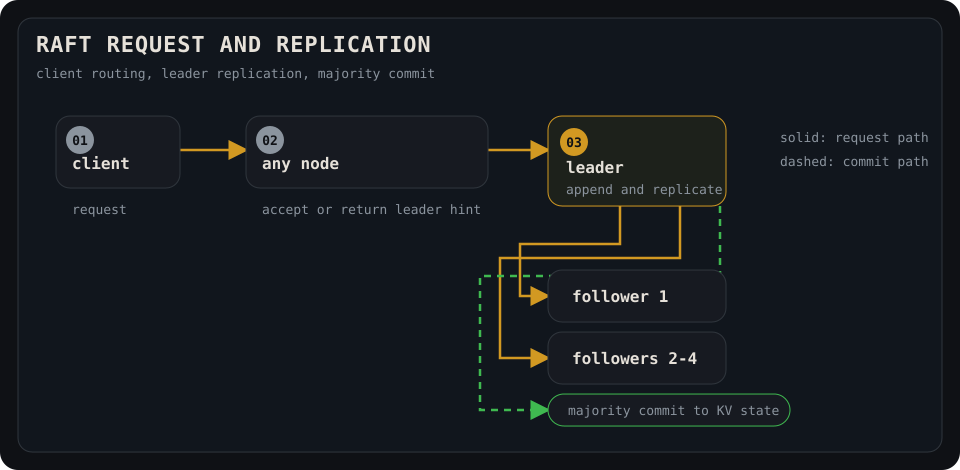

# raft-kv

[](https://github.com/wheevu/raft-kv/actions/workflows/ci.yml)

A learning implementation of the Raft consensus algorithm in Rust, with a deterministic simulator and a real process runner over raw TCP. Not a production database.

## Requirements

- Stable Rust with Rust 2024 edition support
- Docker Compose v2, only for the Prometheus and Grafana observability stack


## Quickstart

Start a three-node cluster in separate terminals:

```bash
cargo run --bin raft-node -- 0 ./data/node0.bin \
  0=127.0.0.1:5000 1=127.0.0.1:5001 2=127.0.0.1:5002

cargo run --bin raft-node -- 1 ./data/node1.bin \
  0=127.0.0.1:5000 1=127.0.0.1:5001 2=127.0.0.1:5002

cargo run --bin raft-node -- 2 ./data/node2.bin \
  0=127.0.0.1:5000 1=127.0.0.1:5001 2=127.0.0.1:5002
```

Write and read a key:

```bash
cargo run --bin raft-client -- 127.0.0.1:5000 127.0.0.1:5001 127.0.0.1:5002 set foo bar
cargo run --bin raft-client -- 127.0.0.1:5000 127.0.0.1:5001 127.0.0.1:5002 get foo
```

## What this is

A from-scratch Raft core that understands leader election, log replication, majority commit, and crash recovery. It can run in a deterministic discrete-event simulator (fake time, in-memory messages, injectable partitions and stops) or as real TCP processes with bincode framing and atomic disk persistence.

## Features

- 3–5 node clusters
- leader election with randomized 150–300 ms election timeouts
- 50 ms heartbeats
- client retries supplied peer addresses until one accepts the request
- replicated, committed writes through the leader
- committed-state reads through the leader (reads blocked until leader proves current term)
- log replication with majority commit
- leader backtracking via `next_index`
- deterministic partition/failover tests (simulator)
- seeded simulator fault plans with delay, drop, duplicate, reorder, and lifecycle faults
- operation histories with a deterministic linearizability checker and minimized counterexamples
- length-prefixed `bincode` frames over raw TCP
- batched outbound messages per peer (one TCP connection per destination per send cycle)
- atomic persistence: term, vote, log, and commit index via temp-file fsync + rename
- committed commands apply into a disk-backed LSM-tree state machine
- LSM write-ahead log, memtable flushes, SSTables with sparse indexes, bloom filters, tombstones, and explicit compaction
- opt-in versioned snapshots, install-snapshot transfer, and log-prefix compaction
- process-level kill/restart and full-cluster restart integration tests

## Current limitations

- snapshots and log compaction are opt-in; the built-in snapshot state machine is the in-memory simulator
- simulator `stop`/`restart` faults pause and resume the same in-memory node; durable crash recovery is covered separately by the process-level TCP tests
- no dynamic membership changes
- no TLS or authentication
- `/metrics` has no authentication; bind it to localhost for local demos
- reads require the leader to have committed at least one entry in its current term (basic read-safety check, not full read-index)
- no connection keep-alive - each send cycle opens fresh TCP connections
- no range scans or multi-column-family storage; the LSM is point-read/write only

## Shape of the system



## Failover story

The simulator records the path from a steady leader to crash, election, and recovery.

The generated timeline ([`docs/failover.svg`](docs/failover.svg)) and the explanatory story show different simulator traces, not one canonical node-by-node sequence.

Open the self-contained [interactive trace explorer](docs/raft-explorer.html) to play, pause, step, and inspect deterministic election and failover samples.


## Replicated log


## Replication snapshot

After `set foo bar` commits:

<!-- replication:start -->
| node | role | term | commit | applied | log | kv |
|---:|---|---:|---:|---:|---|---|
| 0 | Follower | 1 | 2 | 2 | [noop, set foo=bar] | foo=bar |
| 1 | Follower | 1 | 2 | 2 | [noop, set foo=bar] | foo=bar |
| 2 | Follower | 1 | 2 | 2 | [noop, set foo=bar] | foo=bar |
| 3 | Follower | 1 | 2 | 2 | [noop, set foo=bar] | foo=bar |
| 4 | Leader | 1 | 2 | 2 | [noop, set foo=bar] | foo=bar |
<!-- replication:end -->

## Metrics

Generated by `cargo run --release --bin raft-demo`. All timings are simulator time (not real wall-clock). These are not real distributed-system performance numbers.

<!-- metrics:start -->
| metric | value |
|---|---:|
| cluster size tested | 5 nodes |
| election timeout | 150–300 ms |
| heartbeat interval | 50 ms |
| first leader elected | 176 ms simulated |
| failover after leader kill | 244 ms simulated |
| write visible on all nodes | 52 ms simulated |
| fault tolerance | 2 failed nodes in a 5-node cluster |
| process-level TCP tests | 3 integration tests |
<!-- metrics:end -->

## Run it

Start three nodes in separate terminals:

```bash
cargo run --bin raft-node -- 0 ./data/node0.bin \
  0=127.0.0.1:5000 1=127.0.0.1:5001 2=127.0.0.1:5002

cargo run --bin raft-node -- 1 ./data/node1.bin \
  0=127.0.0.1:5000 1=127.0.0.1:5001 2=127.0.0.1:5002

cargo run --bin raft-node -- 2 ./data/node2.bin \
  0=127.0.0.1:5000 1=127.0.0.1:5001 2=127.0.0.1:5002
```

Write and read (the client retries the supplied peer addresses until one accepts the request):

```bash
cargo run --bin raft-client -- 127.0.0.1:5000 127.0.0.1:5001 127.0.0.1:5002 set foo bar
cargo run --bin raft-client -- 127.0.0.1:5000 127.0.0.1:5001 127.0.0.1:5002 get foo
cargo run --bin raft-client -- 127.0.0.1:5000 127.0.0.1:5001 127.0.0.1:5002 delete foo
```

## LSM-tree storage engine

The replicated state machine now sits behind a `StateMachine` trait. The simulator still uses an in-memory map, while real `raft-node` processes use a small on-disk LSM tree.


The LSM writes each committed command to a fsynced WAL before updating a `BTreeMap` memtable. When the memtable grows past its threshold, it flushes to a sorted SSTable with a sparse index and bloom filter. Reads check the memtable first, then SSTables from newest to oldest. Deletes are stored as tombstones until compaction cleans them up.

By default, compaction runs automatically when four SSTables accumulate and merges them into one replacement table. The replacement is written and made durable before the old tables are removed. On startup, the engine reloads SSTables and replays the WAL, including recovery from an incomplete final WAL frame.

This full-merge strategy keeps the implementation simple, but leveled compaction would scale better with many SSTables.

## Observability

Each `raft-node` process exposes a small unauthenticated Prometheus endpoint at `/metrics`. By default the metrics port is the Raft port plus 1000, so the run commands above expose metrics on `6000`, `6001`, and `6002`. You can override that per process with `RAFT_KV_METRICS_ADDR`.


The endpoint exports Raft term, role, commit/apply indexes, elections, leader changes, client writes whose handlers observed leader-side commit/apply, leader-side replication lag, and a few LSM gauges. `raft_write_latency_seconds` measures that handler-observed write latency, not every Raft commit. Metrics use the `prometheus` crate directly because the project only needs one local registry per node and Prometheus text output.

Structured logs use `tracing`: human-readable by default, or JSON with `RAFT_KV_LOG=json`.

Run Prometheus and Grafana:

```bash
docker compose -f observability/docker-compose.yml up
```

The included Prometheus config scrapes the host through `host.docker.internal`, while the sample nodes bind metrics to `127.0.0.1`.
If Docker cannot reach host loopback on your system, set `RAFT_KV_METRICS_ADDR` to a host-reachable address.

Then start the three `raft-node` processes from the run section, write a few keys with `raft-client`, and kill the current leader. Grafana will be at <http://localhost:3000> with a preloaded `raft-kv live cluster` dashboard showing the role map, term, commit index, observed write rate, replication lag, and LSM compaction activity.

Regenerate README artifacts:

```bash
cargo run --release --bin raft-demo
```

## Test it

```bash
cargo test
cargo clippy --all-targets --all-features -- -D warnings
```

The simulator includes Rust equivalents of the 6.824 tests: `TestInitialElection`, `TestReElection`, `TestBasicAgree`, `TestFailAgree`, `TestFailNoAgree`, `TestConcurrentStarts`, and `TestRejoin`.

The suite also covers persistence, frame encoding, metrics, and real TCP process integration tests including leader kill/restart and full-cluster crash recovery.

## Documentation

- [`docs/replication.md`](docs/replication.md): replicated-log and snapshot details.
- [`docs/system-shape.svg`](docs/system-shape.svg): client routing, leader replication, and majority commit.
- [`docs/metrics.md`](docs/metrics.md): metrics definitions and generated dashboard data.
- [`docs/election.svg`](docs/election.svg): election timeline.
- [`docs/failover.svg`](docs/failover.svg): deterministic failover flow.
- [`docs/failover-story.svg`](docs/failover-story.svg): failover trace illustration.
- [`docs/log-ledger.svg`](docs/log-ledger.svg): replicated log view.
- [`docs/raft-explorer.html`](docs/raft-explorer.html): interactive deterministic trace explorer.
